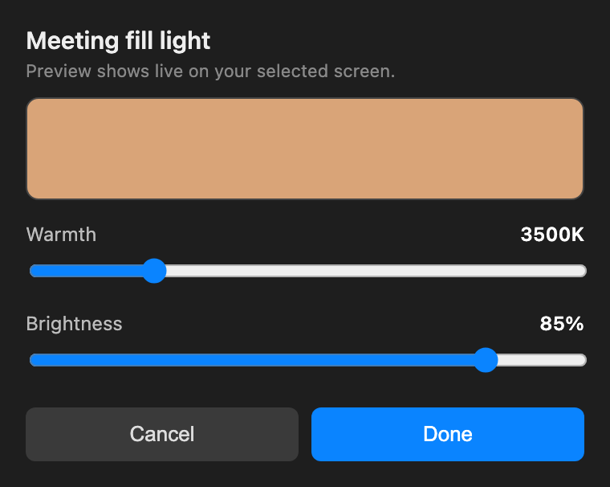

# Meeting Light 💡

Turns your second monitor into a soft fill light whenever you're on a video call, then puts your wallpaper back when the call ends. It works with Zoom, Teams, and Google Meet (including the browser versions), because it watches your camera instead of any one app.



## Why

Good lighting makes a big difference on calls, and most of us already have a spare screen sitting right there. Instead of buying a ring light, this fills your chosen screen with a warm white glow that lights up your face, and it flips on and off by itself so you never have to think about it.

## What it does

- Detects when your camera turns on (any app, including browser tabs) and lights up the screens you pick
- Restores your real wallpaper the moment the camera turns off
- Lives in the menu bar so you can pause it or choose which screens get lit
- Has a slider panel for warmth (color temperature) and brightness, with a smooth live preview right on the monitor
- Remembers your settings and starts on login
- Only touches the screens you choose, so your main display is left alone

## Requirements

- A Mac (works on both Apple Silicon and Intel)
- [Hammerspoon](https://www.hammerspoon.org), a free Mac automation app

## Install

1. Install Hammerspoon:
   ```sh
   brew install --cask hammerspoon
   ```
   or download it from hammerspoon.org and drag it to Applications.

2. Drop `init.lua` into your Hammerspoon config folder:
   ```sh
   cp init.lua ~/.hammerspoon/init.lua
   ```
   Already using Hammerspoon? Don't overwrite your setup. Paste the contents of `init.lua` into your existing `~/.hammerspoon/init.lua` instead.

3. Launch Hammerspoon, or click its menu bar icon and pick "Reload Config".

4. Say yes to the permission prompts the first time. macOS will ask Hammerspoon to control "System Events" (that's how it reads and restores your wallpaper) and maybe for camera access. Grant them, otherwise the wallpaper swap can't happen.

You'll know it worked when a 💡 shows up in your menu bar.

## Using it

Click the 💡 in the menu bar:

- **Auto-white during meetings** flips the whole thing on or off
- **White these screens** lets you tick which displays get lit (it defaults to your secondary screens and leaves your main one alone)
- **Adjust light** opens the slider panel for warmth and brightness
- **Save current wallpaper as default** and **Restore wallpaper now** are there for the rare times you need them

The icon tells you the state at a glance:

- 💡 on and waiting
- ⚪ camera is live, screen is lit
- 🌙 paused

### The slider panel

Drag Warmth and Brightness and the selected screen updates live and smoothly. Cooler is brighter and more neutral, warmer is softer and a bit dimmer. Hit Done to keep it or Cancel to go back to what you had.

## A few things worth knowing

- It keys off your camera, so a call where your camera stays off won't trigger it. There's no reliable "mic in use" signal on macOS to fall back on.
- Anything that uses the camera will trigger it (Photo Booth and friends), which is usually exactly what you want.
- Warm settings are dimmer by nature, since warm means less blue and green light. For the most light, go cool at 100%.
- The brightness slider controls the on-screen color, not your monitor's backlight. On an external monitor the backlight is set with the monitor's own buttons, so turn that up too if you want more punch.

## How it works (the short version)

- Hammerspoon's camera watcher tells us the instant the camera goes in use or idle.
- When it goes live, we save your current wallpaper, then set the chosen screens to a solid color image generated on the fly from a color temperature plus a brightness factor.
- When it goes idle, we put your saved wallpaper back.
- The live preview in the slider panel uses a full screen canvas overlay instead of rewriting the wallpaper, so dragging is smooth with none of the wallpaper crossfade flicker.
- Reading and writing the wallpaper goes through AppleScript (System Events), because Hammerspoon's own wallpaper reader is unreliable on recent macOS.

## Files it creates

On first run it writes a few small files next to the config:

- `meeting_light_settings.lua` for your preferences
- `wallpaper_snapshot.lua` for the wallpaper to restore
- `mlfill_live0.png` and `mlfill_live1.png` for the generated fill images

These are per machine and safe to delete, since they get recreated.

## Credits

- Built on [Hammerspoon](https://www.hammerspoon.org)
- Color temperature to RGB uses Tanner Helland's well known approximation

## License

MIT, see [LICENSE](LICENSE).
